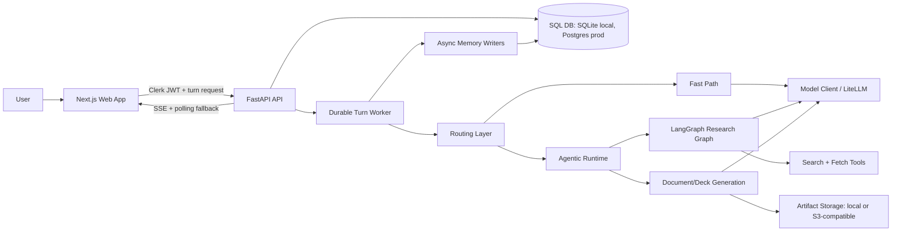
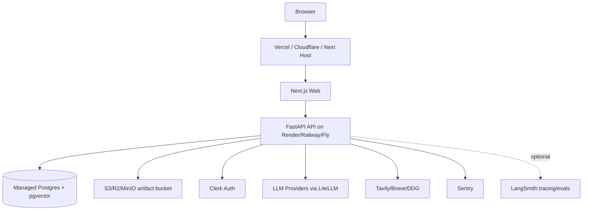

# Fronei Complete Architecture And AI Primer

Last updated: 2026-07-03

This document explains Fronei as it is implemented today: the product architecture, technical stack, deployment shape, AI/agent architecture, data model, memory system, evaluation harness, and the key AI terms that matter for this application.

Fronei is best understood as a personal AI workbench, not a single chatbot. The user asks for work in natural language; Fronei routes the turn, decides whether it can answer quickly or must run a deeper workflow, optionally searches and reads sources, generates artifacts, records events and outputs, and gradually builds context across conversations and workspaces.

## 1. Executive Architecture Summary

Fronei is a two-application system:

- `apps/web`: a Next.js/React frontend that provides the user workspace, chat timeline, composer, sources/events/artifacts panel, profile view, admin UI, and memory/facts UI.
- `apps/api`: a FastAPI backend that owns authentication enforcement, agent routing, model calls, research workflows, document/deck generation, persistence, background workers, evaluations, and admin controls.

The primary runtime pattern is:

1. The web app authenticates the user with Clerk and sends a turn request to the API.
2. The API persists a durable `Turn` row and streams events/results back to the UI.
3. A bounded worker claims the turn from the database using leases.
4. The agent stack classifies context need, chooses a route, and executes either fast direct answer, quick web answer, full research, document generation, or research plus document generation.
5. The runtime records events, tool calls, sources, artifacts, model telemetry, cost, latency, and final answer.
6. Background memory jobs summarize completed sessions and extract durable facts where appropriate.
7. The UI displays the answer, sources, events, artifacts, and context sources used.

At a high level:

## 2. Tech Stack

### Frontend

Primary files:

- `apps/web/package.json`
- `apps/web/app/components/AgentShell.tsx`
- `apps/web/app/hooks/useAgent.ts`
- `apps/web/app/hooks/useTurnRunner.ts`
- `apps/web/app/components/ContextPanel.tsx`
- `apps/web/app/components/LibraryPanel.tsx`
- `apps/web/app/components/FactsPanel.tsx`
- `apps/web/app/admin/components/AdminShell.tsx`

Technologies:

| Layer | Technology | Use in Fronei |
|---|---|---|
| Framework | Next.js 16 | App shell, routing, production build, server/client boundary |
| UI runtime | React 19 | State-driven agent workspace UI |
| Language | TypeScript | Shared frontend types and safer UI contracts |
| Auth | Clerk Next.js SDK | Sign-in/sign-up, JWT acquisition for API calls |
| Styling | Tailwind CSS, custom CSS | Responsive three-panel UI, dark/light theme |
| Icons | Lucide React, Tabler icons | Toolbars, panels, admin controls |
| Markdown | `marked`, `highlight.js`, `dompurify` | Render model answers and code safely |
| Charts | Recharts | Admin/eval/profile visualizations |
| Testing | Vitest, Playwright | Unit and browser-level regression coverage |

Frontend architecture patterns:

- Three-pane desktop shell: library rail, work/chat pane, context rail.
- Mobile drawer/sheet layout for library and context.
- Server-sent event streaming with polling recovery.
- Token smoothing in the browser to make model streams feel continuous.
- Strong separation between product state hooks and visual components.
- Admin UI embedded in the same web application, gated by backend auth.

### Backend

Primary files:

- `apps/api/pyproject.toml`
- `apps/api/app/main.py`
- `apps/api/app/config.py`
- `apps/api/app/db/models.py`
- `apps/api/app/routers/*.py`
- `apps/api/app/services/agent/*`

Technologies:

| Layer | Technology | Use in Fronei |
|---|---|---|
| API framework | FastAPI | REST endpoints, streaming endpoints, OpenAPI |
| Language | Python 3.11 | Agent orchestration, data processing, file generation |
| Data validation | Pydantic v2 | Settings, request/response contracts, agent models |
| ORM | SQLAlchemy 2 | Database models, sessions, query execution |
| Migrations | Alembic | Production-safe schema evolution |
| LLM abstraction | LiteLLM | OpenAI, Anthropic, Gemini, OpenRouter model calls |
| Agent graph | LangGraph | Durable multi-step research graph with checkpoints |
| Checkpointing | `langgraph-checkpoint-sqlite` | Resume/pause/debug graph state |
| HTTP client | HTTPX | Search/fetch and provider calls where needed |
| Search | Tavily, Brave, DuckDuckGo fallback | Web research and quick lookup |
| Documents | PyMuPDF, python-docx, python-pptx, openpyxl | Extraction and artifact generation |
| Artifact storage | Local filesystem or S3-compatible storage via boto3 | Generated files and templates |
| Observability | Structured logs, Sentry, optional LangSmith | Runtime visibility and debugging |
| Testing | pytest, ruff | API/unit/eval regression coverage |

### Database

Fronei supports:

- SQLite by default for local development.
- Postgres in production via `DATABASE_URL`.
- pgvector-ready session memory when Postgres has vector support.

SQLite-specific settings:

- WAL journal mode for better local concurrency.
- Foreign key enforcement.
- Busy timeout for transient write contention.

Postgres-specific features:

- Stronger production concurrency.
- pgvector embeddings for L2 session recall.
- Optional IVFFlat index on `session_summaries.embedding`.

## 3. Deployment Architecture

Deployment files:

- `infra/docker-compose.yml`
- `infra/Dockerfile.api`
- `infra/Dockerfile.web`
- `infra/render.yaml`
- `render.yaml`
- `railway.toml`

### Local Docker Compose

`infra/docker-compose.yml` runs:

- `api`: FastAPI service on port `8000`, with SQLite mounted at `/data/fronei.db`.
- `web`: Next.js service on port `3000`, pointing at the API service.
- `db_data`: persistent volume for SQLite and LangGraph checkpoint DB.

Local compose is useful for full-stack development without external DB setup.

### Render-style Production

`infra/render.yaml` defines `fronei-api`:

- Runtime: Python service.
- Root: `apps/api`.
- Build: `pip install -e .`
- Pre-deploy: `alembic upgrade head`
- Start: `uvicorn app.main:app --host 0.0.0.0 --port $PORT`

Important production environment variables:

- `APP_ENV=production`
- `DATABASE_URL=postgresql+psycopg://...`
- `ALLOWED_ORIGINS=https://frontend-domain`
- `CLERK_ISSUER`
- `CLERK_AUDIENCE`
- `CLERK_AUTHORIZED_PARTIES`
- Provider keys: `OPENAI_API_KEY`, `ANTHROPIC_API_KEY`, `GEMINI_API_KEY`, `OPENROUTER_API_KEY`
- Search keys: `TAVILY_API_KEY`, `BRAVE_API_KEY`
- Artifact storage config for S3-compatible storage
- Concurrency limits for memory-constrained instances

### Recommended Production Topology

Recommended production topology:

Notes:

- The API currently starts turn workers and maintenance workers inside the web process. This is simple and works for small deployments.
- As volume grows, split workers into a separate process or service so API request handling and background execution scale independently.
- SQLite is fine locally, but production should use Postgres, especially for concurrent turns, admin runs, vector recall, and durable queue semantics.
- Generated artifacts should use S3-compatible storage in production rather than local disk.

## 4. Application Boundaries

### Web Application Boundary

The web app owns:

- Authentication user experience.
- Workspaces and conversation navigation.
- Composer controls: quality mode, output format, research level, comparison mode, attachments, templates.
- Live response streaming and recovery.
- User-visible context: events, sources, artifacts, memory used.
- Profile/preferences/facts UI.
- Admin dashboard.

It does not own:

- Model selection.
- Agent routing.
- Source credibility decisions.
- Database writes.
- Auth authorization decisions.

### API Boundary

The API owns:

- Auth verification and active-user gating.
- Workspace/conversation/turn persistence.
- Durable turn queue and leases.
- Agent routing and execution.
- Model provider abstraction.
- Search/fetch/tools.
- Document/deck generation.
- Memory writes and recall.
- Admin settings, model policy, evals, and audit logs.

### Agent Runtime Boundary

The agent runtime owns the decision process inside one turn:

- Classify context needs.
- Pick fast path versus full agentic path.
- Decide route: direct, clarify, research, document, research_document.
- Run tool or graph workflows.
- Stream progress and answer deltas.
- Attach sources, artifacts, telemetry, and context provenance.

## 5. Request Lifecycle

Typical turn lifecycle:

1. User submits a message in `AgentShell`.
2. `useTurnRunner` ensures there is an active conversation.
3. The frontend sends the request to the agent endpoint using an authorized fetch.
4. The backend creates a durable `Turn` row.
5. The frontend subscribes to turn status/events via SSE, with polling fallback.
6. The turn worker claims the queued turn using a lease.
7. The runtime builds a `TurnRequest`.
8. Context classifier decides whether context is needed.
9. Fast router checks whether a cheap route is safe.
10. If fast: direct answer or quick web path executes.
11. If agentic: orchestrator chooses direct/clarify/research/document/research_document.
12. Research may run through LangGraph.
13. Document and deck requests generate artifacts.
14. The final answer, sources, artifacts, costs, and events are persisted.
15. Background context/memory workers update rolling context, session summaries, and facts.
16. UI appends the completed turn to the timeline.

Important reliability pattern: user response path and memory write path are separated. Memory writes are best-effort and should not break the user turn.

## 6. Routing Architecture

Fronei uses layered routing rather than a single LLM router.

### Context Classifier

File:

- `apps/api/app/services/agent/context_classifier.py`

Purpose:

- Determine whether the turn needs prior conversation, workspace memory, cross-workspace recall, attachments, or live search.

Implemented intents:

- `standalone`
- `same_conversation_followup`
- `vague_unresolved_followup`
- `same_workspace_recall`
- `explicit_cross_workspace_recall`
- `live_current_lookup`
- `attachment_context`

Best practice used:

- Deterministic rules first.
- LLM assist only when deterministic rules say `standalone`, the user message is long enough, and prior turn context exists.
- Conservative fallback: any LLM classifier exception returns `None`, and the deterministic standalone decision remains.

Why this matters:

- The classifier reduces fabrication risk. The system must not claim it remembers something unless a valid context source exists.
- The LLM-assist tier catches implicit follow-ups that pure regex may miss, without putting every turn on a slower model path.

### Fast Router

File:

- `apps/api/app/services/agent/fast_path.py`

Routes:

- `direct_fast`: answer from model plus current conversation/context items.
- `web_fast`: quick current lookup.
- `agentic`: full runtime.

Best practices used:

- Guardrails before LLM call for forced routes, non-chat output, comparison mode, and deep research.
- Grounding guard checks whether router reasoning fabricates prior context.
- Heuristic fallback if the model router fails.
- Model telemetry records preferred model, actual model, fallbacks, latency, and cost.

Why this matters:

- Most user turns should not pay the cost and latency of full research.
- The fast router is a latency optimization, but it is wrapped in safety checks.

### Orchestrator

File:

- `apps/api/app/services/agent/orchestrator.py`

Routes:

- `direct`
- `clarify`
- `research`
- `document`
- `research_document`

Responsibilities:

- Decide when to ask a clarifying question.
- Decide whether a user is asking for an answer or an artifact.
- Choose research level: easy, regular, deep.
- Require confirmation for expensive deep research.
- Fail closed when a model claims unavailable prior context.

Why this matters:

- The orchestrator is the top-level task planner for non-fast turns.
- It maps natural language into executable product workflows.

## 7. Agentic Research Architecture

Primary files:

- `apps/api/app/services/agent/langgraph_runtime/graph.py`
- `apps/api/app/services/agent/langgraph_runtime/nodes.py`
- `apps/api/app/services/agent/research_planner.py`
- `apps/api/app/services/agent/research_synthesis.py`
- `apps/api/app/services/agent/research_evidence.py`
- `apps/api/app/services/agent/research_contracts.py`

Fronei uses LangGraph for durable, multi-step research.

Implemented graph shape:

1. `brief`
2. `subject_derivation`
3. `contract`
4. `plan`
5. `dispatch_search`
6. `search_worker` fan-out
7. `rank`
8. `read`
9. `classify_claims`
10. `expand_source_graph`
11. `bind`
12. `budget_gate_pre_synthesis`
13. `synthesize`
14. `verify`
15. `judge`
16. Optional `budget_gate_pre_repair`
17. Optional `repair`

Key AI best practices:

- Decomposition: break broad research into sub-questions.
- Coverage contract: define what the answer must cover before retrieving.
- Source ranking: prioritize stronger evidence before synthesis.
- Claim classification: distinguish official claims, operational evidence, marketing, anecdote, etc.
- Citation binding: connect answer claims to source evidence.
- Verification: check citation and coverage quality after drafting.
- Repair loop: fix gaps only when judge/verifier says research more is needed.
- Budget gate: stop or require approval when work exceeds budget.
- Checkpointing: persist graph state for pause/resume and crash recovery.

Why this matters:

- Deep research quality comes from workflow discipline, not just a bigger model.
- LangGraph makes a long-running research process observable, resumable, and testable.

## 8. Document And Deck Architecture

Primary files/directories:

- `apps/api/app/services/agent/document_subtree.py`
- `apps/api/app/services/agent/deck_subtree.py`
- `apps/api/app/services/agent/document_ast.py`
- `apps/api/app/services/agent/pptx_design.py`
- `apps/api/pptx_render/`
- `apps/api/app/routers/documents.py`
- `apps/api/app/services/artifact_storage.py`

Capabilities:

- Markdown/document answers.
- DOCX generation.
- PPTX/deck generation.
- Template upload and management.
- Brand/design-system support.
- Artifact download.
- Optional render QA for decks.

Best practices:

- Treat documents/decks as structured artifacts, not only text blobs.
- Keep generated artifacts durable and downloadable.
- Preserve user templates and design systems as reusable assets.
- Separate planning, writing, rendering, and QA.

Why this matters:

- Fronei is a workbench. Artifact generation is core product surface, not an afterthought.
- The application needs repeatable deliverable quality, not just chat responses.

## 9. Context OS And Memory Architecture

The Context OS is Fronei's memory and provenance layer.

Primary files:

- `apps/api/app/services/agent/context_contracts.py`
- `apps/api/app/services/agent/context_classifier.py`
- `apps/api/app/services/agent/context_registry.py`
- `apps/api/app/services/agent/session_memory.py`
- `apps/api/app/services/agent/known_facts.py`
- `apps/api/app/services/agent/fact_extractor.py`
- `apps/api/app/services/agent/persistence.py`
- `apps/web/app/components/ContextPanel.tsx`
- `apps/web/app/components/FactsPanel.tsx`

### Context Layers

| Layer | Meaning | Current implementation |
|---|---|---|
| L1 | Immediate context | Prior turn and attachment context |
| L2 | Cross-session semantic memory | Session summaries with embeddings in Postgres/pgvector |
| L3 | Structured facts | `known_facts` table and pinned facts API/UI |
| L4 | Provenance | Traceable `ContextItem.provenance` strings surfaced to the LLM/UI |

### Context Scopes

| Scope | Meaning |
|---|---|
| `conversation` | Current conversation memory |
| `workspace` | Same workspace memory/facts |
| `cross_workspace` | Explicit recall across workspaces |
| `attachment` | Uploaded file context |

### Context Items

`ContextItem` contains:

- `layer`
- `scope`
- `source_type`
- `content`
- `confidence`
- `provenance`

Provenance examples:

- `L1:prior_turn:conv_<conversation_id>`
- `L1:attachment:uploaded`
- `L2:summary:conv_<conversation_id>`
- `L3:fact:<entity_id>:<fact_key>`

Why this matters:

- Context is not just prompt stuffing.
- Every context fragment has a layer, scope, source type, confidence, and provenance chain.
- This supports user trust, debugging, auditability, and future enterprise positioning.

### L2 Semantic Recall

File:

- `apps/api/app/services/agent/session_memory.py`

Behavior:

- Completed turns are summarized in the background.
- Summaries are embedded with `text-embedding-3-small`.
- Postgres/pgvector can recall similar summaries by cosine distance.
- SQLite returns no L2 recall because vector search is unavailable locally.
- Recall has a PostgreSQL `statement_timeout` and slow-query guard.

AI term: embeddings.

- An embedding is a vector representation of text used for semantic similarity.
- In Fronei, embeddings are useful for "find related prior sessions" even when the user does not repeat exact words.

### L3 Structured Facts

Files:

- `apps/api/app/services/agent/known_facts.py`
- `apps/api/app/services/agent/fact_extractor.py`
- `apps/api/app/routers/facts.py`
- `apps/web/app/components/FactsPanel.tsx`

Behavior:

- Research turns can extract durable facts from the final synthesis.
- Facts are upserted by `(user_id, entity_id, fact_key)`.
- Users can view/edit/delete facts through the facts API/UI.
- Empty fact values are skipped.
- Fact writes are best-effort.

AI term: structured memory.

- Structured memory stores exact key/value facts instead of fuzzy vector chunks.
- In Fronei, this is better for durable project facts, constraints, preferences, and pinned decisions.

### L4 Provenance

Behavior:

- Context sources are tagged and returned as `context_sources`.
- The UI shows "Memory used" so users can see what Fronei relied on.

AI term: provenance.

- Provenance means "where did this context or claim come from?"
- In Fronei, provenance is the trust layer that distinguishes auditable memory from opaque recall.

## 10. Model Architecture

Primary files:

- `apps/api/app/services/agent/model_client.py`
- `apps/api/app/services/agent/model_policy.py`
- `apps/api/app/services/provider_health.py`
- `apps/api/app/routers/admin.py`

Model access pattern:

- All model calls go through `model_client`.
- `model_client` uses LiteLLM.
- Logical model roles map to actual model IDs.
- Model policy is stored in DB-backed admin settings.
- Admins can update model role assignments without redeploying.
- Provider fallback models are used when a preferred model fails.
- Provider circuit health can skip unhealthy providers temporarily.

Current model roles include:

- `fast_router`
- `context_classifier`
- `orchestrator`
- `direct_answer`
- `research_brief`
- `coverage_contract`
- `research_planner`
- `reflection`
- `citation_verifier`
- `repair`
- `document_planner`
- `document_writer`
- `synthesis`
- `synthesis_executive`
- `profile_consolidation`

Best practices:

- Role-based model routing: use cheaper/faster models for classification and routing; stronger models for synthesis.
- Centralized model gateway: one place to manage telemetry, fallback, provider keys, and cost.
- Per-turn admin overrides: useful for debugging model behavior without changing global policy.
- Fallback models: improve resilience during provider outages.
- Circuit breaker: avoid repeatedly calling known-failing providers.

AI term: model routing.

- Model routing means choosing a model based on task type.
- In Fronei, routing preserves quality where it matters and controls cost/latency where cheaper models are enough.

## 11. Data Model Overview

Primary file:

- `apps/api/app/db/models.py`

Key tables:

| Table | Purpose |
|---|---|
| `users` | Local user profile linked to Clerk ID |
| `user_admin_controls` | Approval, suspension, role, budget controls |
| `admin_audit_logs` | Admin action audit trail |
| `admin_settings` | DB-backed settings, including model policy |
| `workspaces` | User workspaces, rolling context, priorities, pinned facts |
| `conversations` | Workspace-scoped conversations |
| `turns` | Durable user turns, status, answer, route, cost, latency, leases |
| `events` | Progress/event stream for a turn |
| `tool_calls` | Tool execution records |
| `artifacts` | Generated downloadable outputs |
| `document_templates` | User-uploaded templates |
| `eval_cases` | Admin-managed evaluation cases |
| `eval_runs` | Evaluation run results |
| `maintenance_jobs` | Durable background maintenance queue |
| `langgraph_run_contexts` | LangGraph run state and pause/resume status |
| `session_summaries` | L2 semantic memory summaries |
| `known_facts` | L3 structured facts |

Data-model best practices:

- User IDs are carried through most user-owned rows for isolation.
- Workspaces scope conversations and context.
- Turns are durable and lease-claimable, making work recoverable.
- Events, tool calls, and artifacts are separate from the final answer for observability.
- Admin settings allow runtime configuration without redeploy.
- Alembic is the only production schema-change mechanism.
- Startup checks fail if DB schema revision does not match code migration head.

## 12. Durable Work And Streaming

Primary files:

- `apps/api/app/services/agent/job_worker.py`
- `apps/api/app/routers/agent.py`
- `apps/web/app/hooks/useTurnRunner.ts`

Patterns:

- Durable queue: a turn is persisted before execution.
- Lease-based worker: a worker claims the turn and heartbeats while running.
- Retry policy: failed/expired leases can be retried up to max attempts.
- Cancellation: turns can be marked cancel-requested.
- SSE streaming: events and answer deltas stream to the browser.
- Polling fallback: frontend can recover if the SSE stream drops.
- Last-event replay: stream consumers can resume after a known event ID.

Why this matters:

- Long-running research or document tasks cannot rely on a single request thread.
- Users need visibility into progress.
- The system needs to survive reconnects and process restarts.

## 13. Auth, Security, And Governance

Primary files:

- `apps/api/app/auth.py`
- `apps/api/app/config.py`
- `apps/api/app/routers/users.py`
- `apps/api/app/routers/admin.py`

Security architecture:

- Clerk handles identity.
- API verifies Clerk JWTs.
- Production requires Clerk issuer, audience, and authorized parties.
- New-user approval can require admin activation.
- Admin allowlists support user IDs and emails.
- CORS is explicit through `ALLOWED_ORIGINS`.
- Admin actions are auditable.
- Per-user budget controls exist.
- Rate limits exist for chat, documents, research, and extraction.
- Internal task endpoints use a shared secret.

Best practices:

- Fail fast on production auth misconfiguration.
- Do not trust frontend admin state; enforce admin status server-side.
- Keep user data scoped by `user_id`.
- Avoid prompt/model logs being shipped to LangSmith unless explicitly enabled.
- Strip provider secrets from error logs.

## 14. Admin And Operations Architecture

Admin surfaces include:

- User management.
- Approval/suspension.
- Monthly budget overrides.
- Routing signals.
- Model policy.
- Evals.
- Audit logs.
- System settings.

Operational workers:

- Turn job worker.
- Maintenance job worker.
- Context/memory update executor.
- Profile consolidation jobs.
- LangGraph checkpoint cleanup.
- Orphaned eval/run reconciliation on startup.

Why this matters:

- Fronei is already structured like an operated product, not just a local script.
- Admin surfaces make it possible to tune routing/model policy based on real behavior.

## 15. Evaluation Architecture

Primary files:

- `apps/api/app/evals/runner.py`
- `apps/api/app/evals/live_runner.py`
- `apps/api/evals/golden_turns.json`
- `apps/api/evals/context_classifier_cases.json`
- `apps/api/evals/research_golden_set.json`
- `docs/agent-evals.md`

Implemented eval categories include:

- Golden turn route behavior.
- Router grounding canaries.
- Context classifier precision/recall.
- Context source/provenance completeness.
- Research golden sets.
- Admin-triggered eval cases.

Recent acceptance signal:

- In-process eval harness reached `146/146` after LLM-assist classifier cases.
- Full API suite passed on clean migrated DB: `765 passed, 1 skipped`.

Best practices:

- Golden tests for known failure modes.
- Deterministic offline stubs for model-assisted classifier cases.
- Route checks separate from answer checks.
- Context-source assertions catch regressions where memory silently disappears.
- Eval cases are seeded into DB on startup idempotently.

AI term: evaluation harness.

- An eval harness is a repeatable test system for model behavior.
- In Fronei, evals are essential because routing and memory quality are product correctness, not just implementation details.

## 16. Observability

Observability features:

- Structured logs.
- Sentry integration.
- Per-turn events.
- Tool call rows.
- Model telemetry: role, preferred model, actual model, attempted models, skipped models, failed attempts, latency, cost.
- Context registry hydration logs.
- Grounding check logs.
- Eval run results.
- Optional LangSmith tracing.

Best practices:

- Log model decisions and routing context, not just final answers.
- Keep provenance and source metadata close to the answer.
- Disable external prompt tracing by default unless explicitly enabled.
- Track cost and latency as first-class turn fields.

## 17. AI Jargon And Fronei Applicability

| Term | Plain meaning | Fronei applicability | Usefulness |
|---|---|---|---|
| Agent | Software that uses models/tools to complete tasks | The agent runtime routes, researches, writes, and generates artifacts | Core execution model |
| Orchestrator | Planner that chooses workflow | `orchestrator.py` chooses direct/clarify/research/document routes | Prevents every request from becoming expensive research |
| Router | Classifier that chooses path/model/tool | Fast router and orchestrator route turns | Controls latency, cost, and safety |
| Fast path | Cheap low-latency path | `direct_fast` and `web_fast` | Keeps ordinary chat responsive |
| Agentic path | Multi-step tool/model workflow | Research and document workflows | Handles complex work |
| LangGraph | Graph framework for agent state machines | Research graph with checkpoints | Enables durable, inspectable workflows |
| Node | Step in a graph | `brief`, `plan`, `rank`, `synthesize`, etc. | Makes workflow modular |
| Edge | Transition between graph nodes | Conditional budget/judge routing | Controls execution flow |
| Checkpoint | Saved graph state | LangGraph checkpoint DB | Enables pause/resume and crash recovery |
| HITL | Human in the loop | Deep/budget approval gates and paused runs | Prevents runaway cost or risky automation |
| Tool calling | Model/runtime uses external functions | Search, fetch, extraction, artifact generation | Lets Fronei act beyond text generation |
| RAG | Retrieval augmented generation | L2 session recall, source retrieval before synthesis | Grounds answers in retrieved context |
| Embedding | Vector representation of text | Session summary vectors | Enables semantic memory |
| Vector search | Similarity search over embeddings | pgvector recall on session summaries | Finds related prior work |
| pgvector | Postgres vector extension | L2 recall storage/query engine | Production memory capability |
| IVFFlat | Approximate vector index | Deferred index on session summaries | Speeds recall as memory grows |
| Structured memory | Exact fact store | `known_facts` table | Reliable recall for facts/constraints |
| Provenance | Traceable source chain | `ContextItem.provenance`, UI memory used | Trust, auditability, debugging |
| Grounding | Tying claims to real context/evidence | Router grounding guard and source-grounded research | Reduces hallucination |
| Hallucination | Model invents unsupported info | Guarded by context classifier, grounding checks, citations | Product trust issue |
| Context window | Model input limit | Context budgets and truncation before prompts | Prevents overload and latency blowups |
| Prompt injection | Malicious/context instructions hijack model | Source separation and tool boundaries reduce exposure | Important for web/file retrieval |
| Classification | Assign label to input | Context classifier, route classifier, claim classifier | Cheap decision primitive |
| Deterministic rule | Code rule, not model judgment | Regex/context rules before LLM assist | Fast, testable, predictable |
| LLM assist | Model used only for ambiguous classifier cases | Context classifier upgrade tier | Improves coverage without full latency cost |
| Fallback | Backup path after failure | Heuristic routing and fallback models | Resilience |
| Circuit breaker | Stop calling failing provider temporarily | Provider health checks | Avoids repeated slow failures |
| Model policy | Mapping roles to models | DB-backed `model_policy.py` | Runtime tunability |
| Synthesis | Combine evidence into answer | Research final answer generation | Main quality surface |
| Verification | Check generated answer | Citation verifier/judge | Catches missing or weak evidence |
| Repair loop | Fix answer after verification failure | Optional graph repair path | Improves quality without full restart |
| Eval | Behavioral test for AI system | Golden turns and classifier/research cases | Prevents regressions |
| Golden set | Curated expected behavior cases | JSON eval fixtures | Stable quality baseline |
| SSE | Server-sent events | Live progress and answer streaming | Better UX for long-running turns |
| Durable queue | DB-backed task queue | `turns` with leases/status | Survives request disconnects |
| Lease | Temporary worker claim | Turn worker claim/heartbeat | Enables retry after crashes |
| Artifact | Generated file/output | DOCX/PPTX/downloadable outputs | Workbench value beyond chat |

## 18. Best Practices Already Present

Architecture:

- Separate web and API applications.
- Centralize model calls through `model_client`.
- Make model policy DB-backed and admin-editable.
- Use migrations for schema changes.
- Fail startup when schema revision is stale.
- Store turns/events/tool calls/artifacts separately.
- Use durable workers for long-running work.
- Use checkpointed graph execution for complex research.

AI safety and quality:

- Deterministic routing guardrails before LLM routing.
- Grounding checks on router decisions.
- Clarify route for ambiguous or unsafe requests.
- Deep research confirmation.
- Context provenance included in prompt and UI.
- Structured facts separate from vector recall.
- Eval canaries for known failure modes.

Product:

- Streaming UI with recovery.
- Visible sources/events/artifacts.
- User-editable facts.
- Admin model policy and evals.
- Profile/settings persistence.
- Workspace-scoped context.

Operations:

- Sentry support.
- Optional LangSmith tracing.
- Rate limits and budget controls.
- Startup reconciliation for orphaned runs.
- Provider fallback and health tracking.

## 19. Important Gaps And Next Architecture Improvements

The application is strong, but several architectural improvements are worth keeping explicit.

### Split API And Worker Processes

Current state:

- Turn workers and maintenance workers start inside FastAPI lifespan.

Why improve:

- Scaling API replicas could duplicate workers unless carefully controlled.
- Worker-heavy tasks can compete with request handling for CPU/memory.

Recommended direction:

- Run API web process separately from worker process.
- Use the same DB lease system, but explicitly configure worker replicas.

### Production Postgres + pgvector As Default For Memory

Current state:

- SQLite local works.
- L2 memory recall no-ops on SQLite.

Why improve:

- Context-rich positioning depends on production-grade recall.

Recommended direction:

- Treat Postgres + pgvector as required for production Context OS.
- Add migration/ops docs for pgvector extension and IVFFlat/HNSW strategy.

### Cross-Workspace Policy Layer

Current state:

- Cross-workspace intent exists.
- Strong policy/UX boundaries still need careful design.

Why improve:

- Cross-workspace memory is powerful but privacy-sensitive.

Recommended direction:

- Add explicit user consent and visible scope controls.
- Log cross-workspace provenance prominently.

### Async Memory Pipeline Isolation

Current state:

- Memory writes are best-effort and use background workers.

Why improve:

- As fact/session write volume grows, memory extraction should not contend with turn completion.

Recommended direction:

- Separate memory jobs into durable maintenance queue.
- Add retry/dead-letter behavior for memory writes.

### Prompt-Injection Hardening

Current state:

- System has separation of sources, routing, and context items.

Why improve:

- Web/file retrieval increases injection risk.

Recommended direction:

- Add explicit source-content sanitization and instruction hierarchy tests.
- Add eval cases for malicious retrieved content.

### Latency Budgets Per Stage

Current state:

- Classifier/recall budgets exist in code.
- Latency measurement scripts and turn latency fields exist.

Why improve:

- Context richness can add latency if not continuously measured.

Recommended direction:

- Track p50/p95 by route and stage.
- Gate releases on fast-path and research latency budgets.

## 20. Strategic Differentiation

Fronei's strongest architectural bet is not simply "has memory" or "uses RAG." The differentiator is context-rich work with provenance:

- It knows when context is needed.
- It knows which layer of context to use.
- It avoids claiming memory when none exists.
- It separates fuzzy semantic memory from exact structured facts.
- It exposes memory sources to the user.
- It can generate real work artifacts, not just answers.
- It has an eval harness to protect these behaviors.

That makes Fronei closer to an AI operating layer for personal workspaces than a general chat UI.

