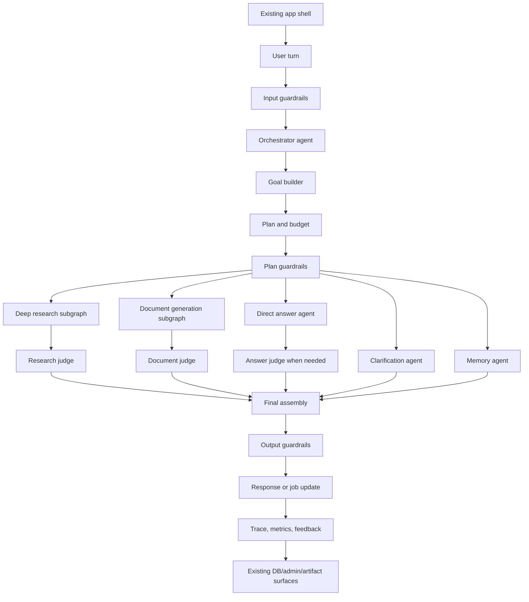
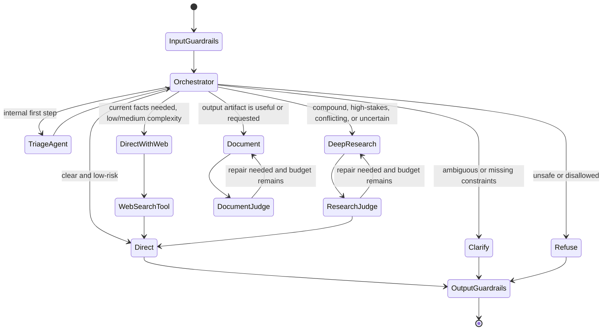

# Fronei Multi-Agent Orchestrator Architecture and Roadmap

Last updated: 2026-06-15

## 1. Purpose

Fronei is moving from a mostly linear chat pipeline into a true agentic execution system: one orchestrator agent controls the turn, specialist agents perform bounded work, tools are explicit and typed, judges evaluate quality, and guardrails enforce safety, cost, privacy, reliability, and user control at every boundary.

The goal is not to create an uncontrolled "agent swarm." The goal is a disciplined operating system for work:

- Most turns should feel fast and simple.
- Complex turns should feel actively worked on, not stuck.
- Research should be evidence-led and adaptive.
- Document generation should behave like a professional production workflow.
- Admins should be able to configure prompts, agents, tools, budgets, judges, and guardrails without code changes.

## 2. North Star

> The orchestrator owns the user's goal. Agents are specialists. Tools are capabilities. Judges are quality reviewers. Guardrails are non-negotiable control points.

This means every user turn follows the same high-level process:

1. Understand the request.
2. Decide whether the system can answer directly, needs clarification, needs web/deep research, needs a document workflow, or needs to refuse/redirect.
3. Create a goal and plan.
4. Route work to specialist agents or subgraphs.
5. Enforce guardrails before and after tools.
6. Judge the result where quality or risk warrants it.
7. Return the best possible output with the least user friction.
8. Persist trace, cost, latency, decisions, feedback, and quality signals.

## 3. Current Baseline

The current codebase already has the beginning of the graph migration:

- `apps/api/app/services/turn_graph/` contains graph state, adapters, nodes, tool registry, research/document wrappers, MCP catalog, and rollout helpers.
- `settings.turn_graph_enabled` controls graph-related behavior.
- `conversations.py` can attach graph shadow traces and route selected work through graph wrappers.
- Admin turn views expose graph trace data.
- Tests cover routing cases, graph adapters, tool wrappers, and progress behavior.

This foundation is useful, but it is not yet a true multi-agent architecture because:

- The orchestrator is still mostly implicit in router/pipeline code.
- Agents are not yet configurable runtime entities.
- System prompts are mostly code constants, not versioned config.
- Goals are not first-class persisted objects.
- Judges exist in places, but are not governed by a unified judge contract.
- Guardrails are distributed across code paths instead of modeled as a control plane.

## 3.1 Migration Stance: Clean Runtime, Not Full Rewrite

Fronei should not be rebuilt from scratch. The product already has valuable,
working infrastructure:

- Clerk/auth integration.
- Conversation persistence.
- Admin views and turn-level telemetry.
- Budget controls.
- Memory and personalization tables.
- Template upload and artifact storage.
- Research connectors and source-processing utilities.
- Document artifact APIs.
- Deployment hardening and pre-start checks.

Rebuilding those would create months of churn and a new layer of bugs. The
right move is a **clean-room agentic runtime beside the existing app shell**:

```text
existing Fronei app shell
  -> new agentic runtime boundary
      -> orchestrator
      -> goals
      -> agents
      -> tools
      -> guardrails
      -> judges
      -> durable jobs
  -> existing persistence, admin, artifacts, auth, memory, and deployment
```

This is a strangler-style migration:

- New runtime contracts are designed cleanly and do not inherit legacy control
  flow.
- Existing APIs and storage are reused where they are boring and stable.
- Old planner/document/research branches remain as fallback during rollout.
- Traffic moves into the new runtime path by path.
- Once a path is stable, the old branch is deleted aggressively.

### Keep

- Auth, users, and tenancy.
- Conversation, turn, and lifecycle logging tables.
- Admin dashboard shell.
- Budget and usage accounting.
- Existing memory/profile data.
- Existing artifact delivery API.
- Existing research source utilities where they are cleanly wrapped as tools.
- Existing deployment and migration safety checks.

### Rebuild Behind the Runtime Boundary

- Orchestrator decision-making.
- Agent definitions and execution loop.
- Prompt registry and prompt versioning.
- Goal model and goal lifecycle.
- Tool registry and tool permissioning.
- Guardrail control plane.
- Judge contracts and repair loops.
- Deep research as a multi-agent subtree.
- Document generation as a multi-agent subtree.

### Retire Aggressively

- Scattered planner branches in `conversations.py`.
- Hidden output fallbacks, especially PPTX-to-markdown fallback.
- Template/theme fallback that silently ignores user selection.
- Prompt constants embedded across services once registry versions exist.
- Ad hoc modal/control-flow hacks that grew around planner ambiguity.
- Legacy document-generation heuristics that conflict with AgentDeck.

## 4. Target Architecture



## 5. Layered System

### 5.1 Orchestration Layer

Owns the turn lifecycle:

- Builds or updates a goal.
- Decides whether work can be answered directly.
- Decides whether to ask clarifying questions.
- Decides whether web search or deep research is required.
- Decides whether a document, deck, spreadsheet, or normal chat response is the best output.
- Allocates budgets for cost, time, tools, and judge depth.
- Selects agents and subgraphs.
- Receives agent results.
- Applies judge feedback.
- Decides whether to repair, continue, stop, or ask the user.

The orchestrator should be agentic, but bounded. It can reason, but it cannot ignore guardrails, tool permissions, user intent, budget limits, or admin policy.

### 5.1.1 Concurrent Turn and Goal Policy

The orchestrator must handle overlapping turns from the same user explicitly.
This matters because research and document generation can continue after the
chat request returns.

Default policy:

- One active foreground turn per conversation.
- Multiple background jobs may run per conversation if they have distinct goal
  IDs.
- A new user message during an active goal is treated as one of:
  - `append`: add constraints or context to the active goal.
  - `interrupt`: pause current goal and ask whether to revise.
  - `fork`: create a new sibling goal.
  - `cancel`: stop the active goal.
  - `ignore_for_goal`: answer normally without touching the active job.

The orchestrator decides the action, but guardrails enforce boundaries:

- Destructive cancellation requires explicit user intent.
- A new document request should not silently mutate an already-running
  document job.
- A user correction during generation should pause or repair the job if the
  artifact has not been delivered yet.
- If a background job finishes after the user has changed the goal, the result
  must be marked stale or require confirmation before publishing.

Concurrency fields should be stored on `Goal` and `DurableJob`:

- `active_policy`: append, interrupt, fork, cancel, ignore.
- `supersedes_goal_id`.
- `superseded_by_goal_id`.
- `revision`.
- `lock_owner`.
- `lock_expires_at`.

### 5.2 Agent Layer

Agents are configurable specialists. Each agent has a role, prompt, allowed tools, model policy, budget, and guardrail policy.

Initial agent set:

- `orchestrator`: controls the whole turn.
- `triage_agent`: classifies request risk, ambiguity, sensitivity, and likely workflow.
- `clarification_agent`: asks concise questions only when needed.
- `direct_answer_agent`: answers low-risk, clear turns.
- `research_lead`: manages deep research.
- `query_decomposer`: splits compound research questions.
- `source_scout`: finds candidate sources.
- `source_reader`: reads and extracts source content.
- `evidence_extractor`: converts sources into claims.
- `conflict_resolver`: identifies and resolves evidence conflicts.
- `synthesis_writer`: writes research synthesis.
- `document_lead`: manages document/deck workflow.
- `content_strategist`: creates narrative/content plan.
- `evidence_binder`: maps research claims, user data, and source evidence into
  document sections or slide blocks.
- `deck_designer`: creates design plan.
- `artifact_renderer`: invokes renderer tools.
- `repair_agent`: applies targeted plan/render repairs requested by judges.
- `memory_agent`: extracts, updates, and retrieves personal context.
- `answer_judge`, `research_judge`, `document_judge`, `brand_judge`, `cost_judge`: evaluate outputs.

`triage_agent` is not a separate user-visible route. It is the first internal
step inside the orchestrator after input guardrails. Its job is to produce a
cheap structured risk/ambiguity/tool-need assessment that the orchestrator can
accept, override, or escalate to a fuller planning pass.

### 5.3 Tool Layer

Tools are typed capabilities. The orchestrator and agents do not call arbitrary code. They call registered tools.

Examples:

- `answer_directly`
- `ask_clarifying_question`
- `web_search`
- `deep_research`
- `read_url`
- `extract_claims`
- `generate_presentation_plan`
- `render_pptx`
- `run_document_qa`
- `repair_document_plan`
- `retrieve_memory`
- `update_memory`
- `create_job`
- `publish_job_update`

MCP tools can be exposed through the same registry, but MCP should not become a second control plane. MCP is an implementation backend for tool execution.

MCP boundary rules:

- Native tools own Fronei-sensitive operations: auth, tenant checks, memory,
  budget, template ownership, artifact writes, and internal DB access.
- MCP-backed tools are allowed for external capabilities: web providers,
  enterprise knowledge connectors, Google Drive/Gmail, external storage, and
  third-party APIs.
- Every MCP tool must be wrapped by a native `ToolDefinition` with Fronei
  input/output schemas, permission checks, timeout, budget, and guardrail
  policy.
- Agents never choose raw MCP server names. They choose Fronei tool names.
- MCP output is treated as untrusted tool output and sanitized before it is
  sent back into any model context.

### 5.3.1 Tavily as MCP Search Backend

Tavily is the designated MCP-backed implementation for web search and URL
extraction in the research subtree.

**Current state.** `web_context.py` calls Tavily directly via HTTP using
`settings.tavily_api_key`, with Brave and DuckDuckGo as fallbacks. This works
but bypasses the tool registry, guardrail layer, and trace system. The
`turn_graph/mcp.py` catalog already lists `mcp.web.search` as a candidate
adapter for the `web_context` tool.

**Target state.** Tavily is registered as a `ToolDefinition` with
`backend="mcp"` and `backend_ref="mcp.web.search"`. Two Fronei tools map to
Tavily endpoints:

- `web_search` → Tavily `/search` endpoint (advanced depth, optional recency
  filter).
- `read_url` → Tavily `/extract` endpoint (content extraction from a known
  URL).

Example `ToolDefinition` for `web_search`:

```python
ToolDefinition(
    id="web_search",
    name="web_search",
    description="Search the public web for current information.",
    input_schema={
        "query": "str",
        "recency": "Optional[Literal['day', 'week', 'month', 'year']]",
        "max_results": "int",  # capped by guardrail policy; agents cannot exceed it
    },
    output_schema={
        "sources": "list[WebSource]",
        "provider": "str",
    },
    allowed_agent_ids=["source_scout", "direct_answer_agent"],
    guardrail_policy_ids=["tool.ssrf_prevention", "tool.output_sanitize"],
    timeout_ms=15000,
    retry_policy={"max_attempts": 2, "backoff_ms": 500},
    idempotent=True,
    backend="mcp",
    backend_ref="mcp.web.search",
    enabled=True,
    version="1.0.0",
)
```

Tavily MCP rules:

- Tavily output is untrusted. Every result passes through output-sanitize
  guardrails before entering any model context.
- The Tavily API key is a server-side secret. Agents never see it. It is
  referenced only by the MCP adapter layer.
- Fallback chain — Tavily → Brave → DuckDuckGo — is owned by the tool
  adapter, not by individual agents.
- `source_scout` calls `web_search`. It does not call Tavily directly.
- `source_reader` calls `read_url`. It does not call Tavily extract directly.
- `max_results` is capped by the tool's guardrail policy regardless of what
  the calling agent requests.
- SSRF guardrail: `read_url` must reject private-network addresses before
  passing the URL to Tavily extract.

Migration path:

- **Phase A:** Add `web_search` and `read_url` `ToolDefinition` schemas with
  `backend="mcp"` and `backend_ref="mcp.web.search"`.
- **Phase B:** Add `tool.ssrf_prevention` and `tool.output_sanitize` guardrail
  policies. Wire them to `web_search` and `read_url`.
- **Phase E:** Promote `mcp.web.search` adapter from `candidate` to `ready` in
  the MCP catalog. Route `source_scout` through `web_search` tool. Retire
  direct `search_web_sources()` and `crawl_url()` calls from
  `research_orchestrator.py`.
- **Phase E cleanup:** Delete the direct HTTP Tavily block in `web_context.py`
  once `web_search` tool is the active path and evals pass.

Config:

- `TAVILY_API_KEY` remains a server-side env secret. No change to how it is
  stored.
- The admin Providers tab `test_tavily_connection()` helper should migrate to
  a `ToolDefinition` health-check endpoint so it goes through the same
  credential path as production calls.

### 5.4 Guardrail Layer

Guardrails are policy checks that run at explicit boundaries. They are not just prompts. They should be code-enforced where possible, with LLM guardrail classifiers only where judgment is needed.

Guardrails decide whether to:

- `allow`
- `allow_with_constraints`
- `transform`
- `ask_user`
- `require_research`
- `require_judge`
- `redact`
- `block`
- `stop_with_caveat`
- `escalate_to_admin`

### 5.5 Judge Layer

Judges evaluate quality, not permission. Guardrails decide whether something is allowed. Judges decide whether it is good enough.

Judge examples:

- Research judge: evidence quality, source freshness, citation integrity, conflict handling.
- Document judge: slide quality, overflow, storyline, executive readiness, brand fit.
- Answer judge: correctness, completeness, tone, unsupported claims.
- Brand judge: template fidelity, typography, layout, color, forbidden patterns.
- Cost judge: whether additional depth is worth the marginal cost.

Judges should be mode-gated:

- `draft`: minimal or no judge loop.
- `standard`: deterministic checks and targeted judge use.
- `executive`: full judge and repair loop.

### 5.6 Persistence and Observability Layer

Every turn should produce inspectable trace data:

- Orchestrator decision.
- Goal.
- Agents invoked.
- Tools called.
- Guardrails triggered.
- Judge scores.
- Repairs attempted.
- Cost.
- Latency.
- User feedback.

This becomes the foundation for the admin dashboard, debugging, evals, and future learning loops.

Admin trace visibility is not a late-stage feature. Minimal read-only
observability for goals, guardrails, tools, agent runs, and judge results must
land before orchestrator canary traffic. Rich editing/configuration can come
later, but debugging cannot wait until the end.

### 5.7 Tenant Isolation

The API auth layer is necessary but not sufficient. The agent runtime also
needs tenant-aware checks because tools, jobs, memory, templates, artifacts,
and traces may outlive a single request.

Tenant rules:

- Every `Goal`, `AgentRun`, `AgentStep`, `ToolCall`, `DurableJob`, artifact,
  memory read/write, and template lookup carries `user_id` and, later,
  `tenant_id`.
- Tool inputs must be validated against the caller's user and tenant.
- Template/design-system IDs are never trusted without ownership lookup.
- Admin-only actions require role guardrails inside the runtime, not just route
  checks.
- Cross-tenant source caches may store public web content only, never private
  documents, uploaded templates, memory, or artifacts.

### 5.8 Mode Latency and Quality Targets

The orchestrator needs concrete anchors for cost and quality tradeoffs.

Initial targets:

| Mode | Typical use | p50 target | p95 target | Judge depth |
|---|---|---:|---:|---|
| `draft` | Fast sketch, internal iteration | chat < 3s, docs < 25s | chat < 6s, docs < 45s | minimal deterministic checks |
| `standard` | Normal user-facing work | chat < 5s, docs < 45s, research < 150s | chat < 10s, docs < 90s, research < 240s | deterministic checks + targeted judge |
| `executive` | Board/client-ready output | docs < 90s, research < 240s | docs < 180s, research < 360s | full judge and repair loop |

The cost judge can stop or downgrade work if the current run is unlikely to
hit the selected mode's latency/cost envelope.

## 6. Core Data Models

### 6.1 Goal

```python
class Goal(BaseModel):
    id: str
    user_id: str
    tenant_id: str | None = None
    conversation_id: str
    turn_id: str
    parent_goal_id: str | None = None
    supersedes_goal_id: str | None = None
    superseded_by_goal_id: str | None = None
    objective: str
    success_criteria: list[str]
    constraints: list[str]
    output_contract: dict
    sensitivity: str
    criticality: str
    ambiguity: str
    quality_mode: str
    budget: dict
    active_policy: Literal["append", "interrupt", "fork", "cancel", "ignore_for_goal"] | None = None
    revision: int = 1
    lock_owner: str | None = None
    lock_expires_at: datetime | None = None
    status: Literal["created", "running", "waiting_for_user", "completed", "failed", "cancelled"]
```

### 6.1.1 Runtime Budget

```python
class RuntimeBudget(BaseModel):
    max_turn_cost_usd: float
    max_goal_cost_usd: float
    max_latency_ms: int
    max_agent_runs: int
    max_model_calls: int
    max_tool_calls: int
    max_research_rounds: int
    max_sources: int
    max_judge_iterations: int
    max_repair_iterations: int
    allow_paid_search: bool
    allow_parallel_fallback: bool
    quality_mode: Literal["draft", "standard", "executive"]
```

`Goal.budget` should be implemented as `RuntimeBudget` in code. It is shown on
`Goal` as `budget` because persisted rows may store it as JSON, but runtime
callers should not pass arbitrary dictionaries.

### 6.2 Agent Definition

```python
class AgentDefinition(BaseModel):
    id: str
    name: str
    role: str
    prompt_template_id: str
    allowed_tools: list[str]
    model_policy_id: str
    guardrail_policy_ids: list[str]
    judge_policy_id: str | None = None
    max_iterations: int
    max_tool_calls: int
    enabled: bool
    version: str
```

### 6.2.1 Model Policy

```python
class ModelPolicy(BaseModel):
    id: str
    name: str
    allowed_models: list[str]
    primary_model: str
    fallback_models: list[str]
    max_input_tokens: int
    max_output_tokens: int
    max_cost_usd_per_call: float
    timeout_ms: int
    parallel_fallback_enabled: bool = False
    quality_modes: list[Literal["draft", "standard", "executive"]]
    sensitive_domain_allowed: bool = True
    enabled: bool = True
```

Model policy rules:

- The orchestrator can choose among allowed models, but cannot exceed the
  policy's budget, timeout, or sensitive-domain constraints.
- High-risk judges and final executive synthesis can use stronger models.
- Cheap classifiers and guardrail checks should use low-cost models or
  deterministic checks wherever possible.
- Parallel fallback should be reserved for user-facing latency-critical calls,
  not background jobs.

### 6.3 Prompt Template

```python
class PromptTemplate(BaseModel):
    id: str
    agent_id: str
    version: str
    system_prompt: str
    developer_prompt: str | None
    output_schema: dict | None
    variables: list[str]
    status: Literal["draft", "active", "archived"]
```

### 6.4 Guardrail Policy

```python
class GuardrailPolicy(BaseModel):
    id: str
    name: str
    applies_to: list[str]
    checks: list[dict]
    action_map: dict
    severity: str
    enabled: bool
    version: str
```

### 6.4.1 Tool Definition

```python
class ToolDefinition(BaseModel):
    id: str
    name: str
    description: str
    input_schema: dict
    output_schema: dict
    allowed_agent_ids: list[str]
    required_user_roles: list[str] = []
    guardrail_policy_ids: list[str]
    budget_policy: RuntimeBudget | None = None
    timeout_ms: int
    retry_policy: dict
    idempotent: bool
    backend: Literal["native", "mcp", "external_api"]
    backend_ref: str
    enabled: bool
    version: str
```

Tool rules:

- Agents choose `ToolDefinition.id`, never raw MCP server names or Python
  functions.
- Every tool call validates input and output schemas.
- Every tool call runs pre-tool and post-tool guardrails.
- Guardrail-sensitive operations should stay native unless an MCP adapter can
  prove equivalent tenant, permission, and audit controls.

### 6.5 Agent Run and Step

```python
class AgentRun(BaseModel):
    id: str
    goal_id: str
    agent_id: str
    parent_run_id: str | None
    status: Literal[
        "created",
        "running",
        "completed",
        "failed",
        "cancelled",
        "timed_out",
        "budget_exhausted",
        "tool_failed",
        "model_refused",
        "guardrail_blocked",
        "waiting_for_user",
    ]
    failure_code: str | None = None
    failure_message: str | None = None
    retry_count: int = 0
    started_at: datetime
    completed_at: datetime | None
    total_cost_usd: float
    latency_ms: int

class AgentStep(BaseModel):
    id: str
    run_id: str
    step_type: Literal["model", "tool", "guardrail", "judge", "repair"]
    input_summary: str
    output_summary: str
    model_used: str | None
    tool_name: str | None
    latency_ms: int
    cost_usd: float
    metadata: dict
```

Agent failure handling:

- `timed_out`: retry if idempotent and budget remains; otherwise degrade or
  surface retryable failure.
- `budget_exhausted`: stop with caveat or ask admin/user for override.
- `tool_failed`: retry with backoff for transient failures; otherwise select
  alternate tool or fail the subgoal.
- `model_refused`: try an allowed fallback model or ask clarification if the
  refusal appears caused by ambiguous context.
- `guardrail_blocked`: do not retry automatically. Return safe explanation or
  ask user for a compliant alternative.
- `waiting_for_user`: persist state and resume from the same goal after input.

### 6.6 Judge Result

```python
class JudgeResult(BaseModel):
    id: str
    target_type: Literal["answer", "research", "slide", "deck", "document", "tool_output"]
    target_id: str
    judge_agent_id: str
    score: float
    status: Literal["pass", "repair", "fail"]
    issues: list[dict]
    required_repairs: list[dict]
    can_publish: bool
```

### 6.7 Durable Job

```python
class DurableJob(BaseModel):
    id: str
    goal_id: str
    user_id: str
    tenant_id: str | None = None
    conversation_id: str
    turn_id: str
    job_type: Literal["research", "document", "artifact_render", "qa_polish"]
    status: Literal["queued", "running", "waiting_for_user", "completed", "failed", "cancelled", "stale"]
    progress_stage: str
    progress_message: str
    percent_complete: int | None = None
    result_ref: str | None = None
    error_code: str | None = None
    error_message: str | None = None
    idempotency_key: str
    lease_owner: str | None = None
    lease_expires_at: datetime | None = None
    created_at: datetime
    updated_at: datetime
```

Durable job rules:

- Long research and document workflows should run as durable jobs, not
  request-bound work.
- Jobs publish milestone events: queued, planning, searching, extracting,
  synthesizing, designing, rendering, quality_checking, ready.
- Workers must be idempotent by `idempotency_key`.
- A job that finishes after its goal was superseded becomes `stale`.
- Failed jobs return a structured retryable/non-retryable error, never a silent
  markdown fallback.

## 7. Guardrail Architecture

Guardrails must wrap the system at multiple points.

### 7.1 Input Guardrails

Run before orchestration.

Responsibilities:

- Authentication and tenant boundary.
- Request size limits.
- Attachment type and size validation.
- Prompt injection detection.
- Sensitive data detection.
- PII handling.
- Malware or unsafe file markers.
- User role and admin capability checks.

Example outcomes:

- Allow a normal question.
- Redact unnecessary PII.
- Block unsupported attachment type.
- Ask user before using sensitive personal data in memory.
- Reject instructions that attempt to override system policy.

### 7.2 Planning Guardrails

Run after the orchestrator proposes a plan, before execution.

Responsibilities:

- Enforce allowed workflow types.
- Check budget.
- Check user role.
- Check whether the plan is too broad.
- Require clarification if the objective is under-specified.
- Require web or deep research for high-stakes factual questions.
- Require user confirmation for high-cost, destructive, or privacy-sensitive work.

Example outcomes:

- Answer directly.
- Ask one clarification question.
- Suggest deep research with a quiet override.
- Proceed with web search automatically.
- Refuse a plan that would exceed admin budget caps.

### 7.3 Tool Guardrails

Run before and after every tool call.

Responsibilities:

- Validate tool input schema.
- Enforce allowed tools per agent.
- Prevent SSRF and unsafe URL access.
- Enforce file/template ownership.
- Enforce per-tool rate limits.
- Enforce network/domain restrictions.
- Sanitize tool output before feeding it back to an LLM.
- Prevent tool results from injecting new instructions.

Example controls:

- Uploaded templates can only be read by their owner.
- Search tools cannot fetch private network URLs.
- Generated document renderers cannot write outside approved artifact paths.
- Research tools cannot cite a source that was not actually retrieved.

### 7.4 Research Guardrails

Run throughout the research subtree.

Responsibilities:

- Source tiering.
- Source role classification.
- Citation manifest enforcement.
- Freshness checks.
- Claim-to-source linking.
- Conflict detection.
- Sensitive domain handling.
- Legal, medical, financial caveats.
- Stop conditions for diminishing returns.

Rules:

- Official policy claims require primary or authoritative sources.
- Operational reality claims may rely on recent anecdotal evidence, but must be labeled as such.
- Unknown date is not automatically stale for official sources.
- Newer source does not automatically beat older consensus.
- Unsupported claims cannot be cited.

### 7.5 Document Guardrails

Run throughout document generation.

Responsibilities:

- Ensure selected template belongs to the user.
- Ensure brand profile is correctly resolved.
- Prevent fallback to the default theme when a user-selected template exists.
- Prevent debug notes from leaking into speaker notes.
- Validate output format.
- Validate slide count, structure, and required sections.
- Check renderability before delivery.
- Check for overflow, collisions, duplicate labels, missing title/dek, and excessive whitespace.

Rules:

- If PPTX generation is requested, failure must return a retryable artifact-generation error, not markdown.
- If a user selects a template, the plan must preserve that design system or fail loudly.
- QA diagnostics cannot be included in final notes.

### 7.6 Memory and Privacy Guardrails

Run before memory read/write.

Responsibilities:

- Decide what can be remembered.
- Avoid storing sensitive data unless explicitly allowed.
- Respect user scrub/delete actions.
- Respect recency and confidence.
- Prevent cross-user memory leakage.
- Keep memory explainable.

Rules:

- User can remove anything remembered.
- Pinned/user-confirmed memories cannot be overwritten silently.
- Low-confidence inferred memories must be marked uncertain.
- Memory use should be visible in settings.

Memory invocation policy:

- Memory retrieval is allowed on most turns, but should be bounded and cached
  per turn. It should not become a separate high-latency model call for simple
  answers.
- Memory extraction runs asynchronously after the user-visible response unless
  the user explicitly edits memory/settings.
- Memory update requires guardrail classification of sensitivity and user
  preference.
- The orchestrator invokes `memory_agent` synchronously only when:
  - the user asks about remembered context,
  - personalization materially affects the answer,
  - the task uses user-specific templates/preferences,
  - the turn updates profile/memory settings,
  - or a document/research workflow needs user profile constraints.
- Tool calls cannot read memory directly. They request scoped memory through
  the orchestrator or memory tool, which applies privacy and tenant checks.

### 7.7 Output Guardrails

Run before the final response or artifact is returned.

Responsibilities:

- Check unsupported claims.
- Check safety and policy issues.
- Check citations.
- Check confidence and caveats.
- Check tone and user preference.
- Check output format.
- Check that hidden/debug data is not exposed.

### 7.8 Cost and Latency Guardrails

Run continuously.

Responsibilities:

- Per-turn budget cap.
- Per-user budget cap.
- Global monthly budget cap.
- Agent-level tool and iteration caps.
- Mode-based quality depth.
- Marginal-gain stop conditions.
- Admin override support.

Rules:

- Fast turns should not pay unnecessary judge/research costs.
- Deep workflows must publish progress updates.
- The orchestrator must stop when additional work has low expected value.

### 7.9 Human-in-the-Loop Guardrails

Ask the user only when necessary.

Trigger examples:

- The request is ambiguous and the wrong assumption would be costly.
- The plan is high-cost.
- The request is sensitive or high-stakes.
- The system recommends deep research or document generation, but the user may prefer normal chat.
- The tool action affects external state.
- Confidence is too low to proceed responsibly.

UX principle:

- Do not bother the user with implementation details.
- Surface concise choices only when a real decision matters.

## 8. Orchestrator Decision Flow



## 9. Deep Research Multi-Agent Subtree

Deep research should become a subgraph controlled by `research_lead`.

Flow:

1. `research_lead` receives the goal and budget.
2. `query_decomposer` splits the question into subquestions.
3. `source_scout` runs search variants in parallel.
4. `source_reader` crawls and extracts source text in bounded parallelism.
5. `evidence_extractor` extracts claims with source references.
6. `conflict_resolver` identifies disagreements.
7. `research_lead` decides whether another targeted round is worth it.
8. `synthesis_writer` writes the answer.
9. `research_judge` checks citations, evidence quality, conflicts, freshness, and caveats.
10. Orchestrator decides publish, repair, or stop with limitations.

Adaptive depth controls:

- Stop when primary evidence is sufficient.
- Continue only for unresolved conflicts, low source diversity, freshness gaps, or sensitive/high-criticality claims.
- Track marginal information gain per round.
- Do not spend deep-research budget on already-resolved subquestions.

## 10. Document Generation Multi-Agent Subtree

Document generation should become a subgraph controlled by `document_lead`.

Flow:

1. `document_lead` receives objective, audience, output type, quality mode, and template/brand.
2. `content_strategist` creates narrative and structure.
3. `evidence_binder` maps claims/data to document sections.
4. `deck_designer` or document designer creates design treatment.
5. `artifact_renderer` invokes PPTX/DOCX/XLSX render tools.
6. `document_judge` evaluates quality.
7. `brand_judge` checks template fidelity.
8. `repair_agent` makes targeted repairs.
9. Orchestrator publishes preview/download when ready.

Guardrails specific to this subtree:

- No markdown fallback for requested PPTX/DOCX/XLSX.
- No hidden debug notes.
- No template mismatch.
- No uncited research claims in executive artifacts.
- No user-uploaded template access across users.
- No "default dark theme" fallback unless explicitly selected or admin policy allows fallback.

## 11. Configurable Prompt and Agent Registry

Prompts should move out of code constants into a versioned registry.

Initial implementation:

- DB-backed prompt registry with file fallback.
- Admin UI for viewing and editing prompts.
- Versioning with draft, active, archived states.
- Rollout controls by user, percent, or environment.
- Prompt test fixtures before activation.

Prompt types:

- Orchestrator prompt.
- Agent prompts.
- Tool-use prompts.
- Judge prompts.
- Repair prompts.
- Guardrail classifier prompts.

Activation rules:

- Only one active prompt version per agent/environment.
- Prompt edits require validation against fixtures.
- Production prompt changes should be logged.
- Admin should be able to roll back quickly.

## 12. Admin Dashboard Requirements

The admin dashboard should expose:

- Turn traces.
- Conversation rollups.
- Goal state.
- Orchestrator decisions.
- Agent runs and steps.
- Tool calls.
- Guardrail decisions.
- Judge scores.
- Cost by model/tool/agent/user.
- Latency by stage.
- Failure reasons.
- Repair loops.
- User feedback.
- Prompt versions used.

New admin sections:

- Agents
- Prompts
- Guardrails
- Judges
- Tools
- Goals
- Runs
- Evals
- Budgets

## 13. Database Roadmap

Phase 1 tables:

- `agent_definitions`
- `model_policies`
- `prompt_templates`
- `tool_definitions`
- `guardrail_policies`
- `goals`
- `agent_runs`
- `agent_steps`
- `judge_results`
- `tool_call_logs`
- `durable_jobs`

Phase 2 tables:

- `agent_feedback`
- `eval_runs`
- `eval_cases`
- `prompt_rollouts`
- `guardrail_events`
- `budget_events`

Phase 3 tables:

- `agent_capability_scores`
- `component_quality_scores`
- `user_document_preferences`
- `research_source_cache`

## 14. Rollout Strategy

Use staged rollout, not big-bang replacement. The new runtime should be built
as a clean boundary and then used to strangle the old pipeline path by path.

### Stage -1 - Runtime Boundary

- Create the new runtime package boundary.
- Keep existing app shell, routers, DB, admin, artifacts, memory, and auth.
- Define clean contracts for goals, agents, tools, guardrails, judges, and runs.
- Add adapters from existing services into runtime tools.
- Do not route live traffic through the new runtime yet.

### Stage 0 - Shadow Mode

- Orchestrator graph runs alongside current pipeline.
- No user-visible behavior change.
- Compare decisions to current planner.
- Log guardrail decisions.

### Stage 1 - Direct Answer Canary

- Route low-risk direct answers through orchestrator.
- Keep research/document on existing path.
- Measure latency, correctness, fallback rate.

### Stage 2 - Research Subtree

- Move deep research to multi-agent subgraph.
- Keep synthesis output contract stable.
- Add research judge in standard/executive mode.

### Stage 3 - Document Subtree

- Move document/deck generation to document subgraph.
- Keep existing artifact API stable.
- Add brand guardrail and document judge.

### Stage 4 - Admin Config

- Enable prompt and agent registry.
- Allow admin-controlled prompt rollout.
- Add guardrail policy management.

### Stage 5 - Full Orchestrator

- Orchestrator controls all turn types.
- Existing pipeline becomes fallback only.
- Remove obsolete routing branches after stability.

### Stage 6 - Legacy Deletion

- Delete replaced branches from `conversations.py`, `chat_pipeline.py`, and
  document/research routing code.
- Remove legacy prompt constants once prompt registry versions are active.
- Remove legacy document-generation heuristics that are no longer used.
- Keep only explicit fallback adapters with clear owner, metric, and removal
  date.

## 15. Implementation Roadmap

### Phase A - Clean Runtime and Policy Foundation ✅ COMPLETE

**Completed:** 2026-06-15

What was built:

- `apps/api/app/services/agent_runtime/` package, clean alongside `turn_graph/`.
- `models.py` — all runtime schemas: `Goal`, `RuntimeBudget`, `AgentDefinition`,
  `ModelPolicy`, `PromptTemplate`, `GuardrailPolicy`, `ToolDefinition`,
  `AgentRun`, `AgentStep`, `JudgeResult`, `DurableJob`, `RuntimeTrace`.
- `adapters.py` — `RuntimeContext`, `build_goal_from_context`,
  `empty_runtime_trace`, `runtime_trace_payload`.
- `registry.py` — `RuntimeRegistry` with `validate_references()`, `lru_cache`
  loader, `runtime_registry_payload`. File-backed with full cross-reference
  integrity checks.
- `defaults/agents.json` — orchestrator, direct_answer_agent, research_lead,
  document_lead seeded.
- `defaults/model_policies.json` — `model.fast`
  (openrouter/qwen/qwen3.7-max + gpt-4.1-mini) and `model.executive`
  (claude-sonnet-4-6 + qwen fallback).
- `defaults/prompts.json` — active prompts for all four lead agents.
- `defaults/guardrails.json` — `tool.ssrf_prevention`,
  `tool.output_sanitize`, `document.template_ownership` seeded.
- `defaults/tools.json` — `answer_directly`, `web_search` (MCP/Tavily),
  `read_url` (MCP/Tavily), `generate_document` seeded with guardrail bindings.
- `tests/test_agent_runtime_phase_a.py` — 8 tests, all pass.

Over-deliveries (pulled from Phase C):

- `RuntimeRegistry` with reference validation was a Phase C item — done.
- File-seeded defaults for agents, prompts, model policies, guardrails, and
  tools were Phase C items — done.
- Tavily MCP wiring (`backend="mcp"`, `backend_ref="mcp.web.search"`) for
  `web_search` and `read_url` — done.

Outstanding from original Phase A scope:

- Broader compatibility adapters (`ResearchRun → AgentRun`,
  `ConversationTurn → Goal`, research/document/budget service bridges) are
  not yet built. Only `RuntimeContext → Goal` exists. These will be built in
  Phase B as shadow mode requires them.

### Phase B - Guardrail Control Plane

Pre-work already done in Phase A:

- `tool.ssrf_prevention`, `tool.output_sanitize`,
  `document.template_ownership` guardrail schemas are seeded in
  `defaults/guardrails.json`.
- `ToolDefinition` → `guardrail_policy_ids` binding is complete for all
  seeded tools.

Remaining deliverables:

- `agent_runtime/guardrails.py` — `GuardrailService` with
  `evaluate(policy, context) -> GuardrailDecision`.
- Implement deterministic check types: `url_public_network_only`,
  `block_private_ip_ranges`, `strip_tool_instructions`,
  `require_source_manifest`, `template_belongs_to_user`,
  `no_silent_default_template_fallback`.
- Input, planning, tool (pre/post), and output guardrail hooks wired into
  `turn_graph` as shadow-mode side effects.
- `guardrail_events` log table and DB write path.
- `ResearchRun → AgentRun` and `ConversationTurn → Goal` compatibility
  adapters needed for shadow event enrichment.
- Read-only admin trace view for guardrail decisions per turn.
- Guardrail eval fixtures for allow, ask_user, require_research, redact, and
  block outcomes.

Acceptance criteria:

- Guardrails run in shadow mode with no user-visible behavior change.
- Admin can see guardrail decisions per turn.
- Tests cover allow, ask_user, block, and require_research actions.
- No guardrail is implemented only as prompt text when a deterministic check
  is feasible.
- Guardrail evals must pass before any policy can be enabled outside shadow
  mode.

### Phase C - Agent and Prompt Registry

Pre-work already done in Phase A:

- File-seeded defaults for agents, prompts, model policies, guardrails, and
  tools are complete (`defaults/*.json`).
- `RuntimeRegistry` with `lru_cache` loader and `validate_references()` is
  complete (`registry.py`).

Remaining deliverables:

- DB migrations for `agent_definitions`, `prompt_templates`,
  `model_policies`, `tool_definitions`, `guardrail_policies` tables.
- DB-backed loader that replaces file loader when tables are populated;
  file fallback remains.
- Admin read view for agents, prompts, model policies, guardrails, and tools.
- Prompt version stored in `RuntimeTrace` and surfaced in admin turn view.
- Prompt fixture runner: validate prompt changes against golden scenarios
  before activation.

Acceptance criteria:

- Orchestrator and at least two specialist agents load from DB registry,
  with file fallback if tables are empty.
- Prompt version used is stored in trace.
- Rollback to previous prompt version works.
- Existing code constants remain as fallback only until their path is
  migrated.
- Prompt or model policy activation requires fixture pass.

### Phase D - Orchestrator Agent

Deliverables:

- Orchestrator node in `turn_graph` backed by `agent_runtime` schemas.
- Goal builder wired from `build_goal_from_context`.
- Plan/budget builder using `RuntimeBudget`.
- Plan guardrails (calls Phase B `GuardrailService`).
- Direct answer route through `direct_answer_agent`.
- Clarification route through `clarification_agent`.
- Goal/run/step trace written to DB and surfaced in admin.

Acceptance criteria:

- Low-risk direct turns work through orchestrator.
- Ambiguous prompts ask concise clarification.
- High-stakes/current prompts recommend search or research.
- Trace shows why the decision was made.
- Existing planner branch remains available behind rollback flag.
- Admin can inspect orchestrator decision, guardrails, model policy, and cost
  for every canary turn.

### Phase E - Deep Research Multi-Agent Subtree

Deliverables:

- Research lead.
- Query decomposer.
- Source scout.
- Source reader.
- Evidence extractor.
- Conflict resolver.
- Synthesis writer.
- Research judge.

Acceptance criteria:

- Research pipeline supports per-subquestion budgets.
- Crawling/search run in bounded parallelism.
- Citation manifest is complete.
- Research judge can require repair.
- User sees progress milestones.
- Current research engine is either wrapped as tools or replaced stage by stage;
  no duplicated research control flow remains after cutover.

### Phase F - Document Multi-Agent Subtree

Deliverables:

- Document lead.
- Content strategist.
- Designer.
- Renderer tool wrapper.
- Brand guardrail.
- Document judge.
- Repair loop.

Acceptance criteria:

- User-selected templates are honored.
- No markdown fallback when PPTX is requested.
- Debug notes are stripped.
- Executive mode runs judge/repair loop.
- Standard mode returns faster with deterministic checks.
- Legacy document generation remains available only as explicit fallback during
  migration, never as silent fallback.
- Lighthouse deck evals must pass before document subtree can be enabled for
  non-admin users.

### Phase G - Admin Dashboard

Deliverables:

- Agent editing.
- Prompt editing.
- Guardrail editing.
- Judge rubric editing.
- Goal/run trace view.
- Conversation rollups.
- Budget and latency dashboards.

Acceptance criteria:

- Admin can inspect every agent/tool/guardrail/judge step for a turn.
- Admin can see p50/p95 latency by stage.
- Admin can compare costs by agent/model/workflow.
- Admin can safely edit config with draft/active/archive lifecycle and rollback.

### Phase H - Feedback Loop

Deliverables:

- User feedback capture.
- Regeneration/edit signals.
- Judge outcome aggregation.
- Agent capability scores.
- Prompt eval suite.
- Business outcome scorecard.

Acceptance criteria:

- Bad outputs can be traced to agent/prompt/tool/component.
- Feedback influences future selection only behind a feature flag.
- Admin can view quality trends.

### Phase I - Cutover and Cleanup

Deliverables:

- Full orchestrator enabled for target users.
- Old routing branches removed or kept as explicit fallback.
- Documentation and runbooks updated.
- Legacy prompt constants and theme/archetype branches removed after stable
  replacement.

Acceptance criteria:

- Production can roll back by feature flag.
- No known markdown fallback for artifact requests.
- Admin has enough observability to debug failures.
- Every remaining fallback has an owner, metric, and removal date.

---

*Frontend phases run in parallel to backend phases B–I.*

---

### Phase J - Frontend Shell (parallel to Phase B)

**Track:** Frontend
**Route:** `/v2`

Deliverables:

- `apps/web/app/v2/layout.tsx` — new shell layout, three-zone (sidebar /
  conversation pane / work pane).
- `apps/web/app/admin/layout.tsx` — separate admin shell layout.
- Tailwind CSS and shadcn/ui installed and configured to reference existing
  CSS variable tokens.
- `@tabler/icons-react` package replacing CDN webfont.
- `<Shell>` component with responsive sidebar collapse.
- `<ConversationSidebar>` extracted and cleaned from `Sidebar.tsx`.
- `<MessageThread>` extracted from `page.tsx`, handling markdown, code
  highlight, and DOMPurify sanitization.
- `<InputBar>` with quality mode selector (draft / standard / executive),
  attachment, and send.
- `/v2` route live in staging with Clerk auth working.

Acceptance criteria:

- `/v2` renders a complete chat session end-to-end against the existing API.
- Existing `/` is completely unchanged.
- Quality mode selector is visible and sends the correct profile to the API.
- Mobile layout collapses correctly.
- Light/dark theme toggle works.

### Phase K - Agentic UI Components (parallel to Phase D)

**Track:** Frontend
**Route:** `/v2`

Deliverables:

- `<GoalStatusBar>` — shows active goal status, quality mode, and estimated
  cost, driven by turn response metadata.
- `<AgentProgressPanel>` — collapsible step timeline, populated from
  `RuntimeTrace` data in the API response.
- `<DurableJobCard>` — milestone progress for research and document jobs
  (queued → planning → searching → extracting → synthesizing →
  quality_checking → ready).
- `<GuardrailChoiceCard>` — inline choice card rendered in the message
  thread when the API signals `ask_user`.
- `<StaleJobBanner>` — surfaces when a delivered result is marked stale.

Acceptance criteria:

- `<DurableJobCard>` can be driven by mock data with no API dependency.
- `<AgentProgressPanel>` renders step timelines from the `runtime_trace`
  field in API responses.
- `<GuardrailChoiceCard>` renders correctly for all guardrail action types
  that require user input.
- No existing API contract changed to support these components.

### Phase L - Work Pane and Command Palette (parallel to Phase E/F)

**Track:** Frontend
**Route:** `/v2`

Deliverables:

- `<ResearchPane>` — source list, citation links, evidence quality
  indicator, research judge score, conflict flags.
- `<ArtifactViewer>` — PPTX/DOCX/XLSX preview, download button,
  regenerate trigger.
- `<CommandPalette>` — Cmd+K: switch conversation, new chat, change quality
  mode, open settings, jump to admin.
- Work pane slides in when a research or document job is active; collapses
  when idle.

Acceptance criteria:

- Work pane does not break the conversation pane layout at any viewport.
- Command palette is accessible from keyboard only.
- Artifact viewer renders a PPTX preview without requiring a plugin.

### Phase M - Admin Shell (parallel to Phase G)

**Track:** Frontend
**Route:** `/admin`

Deliverables:

- `<TurnTrace>` — full orchestrator decision, agent steps, tool calls,
  guardrail events, judge results, cost, and latency for a single turn.
- `<GuardrailEventLog>` — tabular view of guardrail decisions with filters
  by boundary, action, policy, and user.
- `<RegistryView>` — read-only tables for agents, prompts, model policies,
  tools, and guardrails.
- `<RegistryEditor>` — edit registry entries with draft/active/archive
  lifecycle, diff view, and rollback (requires Phase G backend).
- `<BudgetDashboard>` — cost by model/agent/workflow, p50/p95 latency by
  stage, time-range selector.

Acceptance criteria:

- Admin can view a full turn trace with all agent steps and guardrail events.
- Registry editor cannot activate a prompt without fixture pass (enforced
  by the backend; UI surfaces the result).
- `/admin` route is protected by admin role check independent of the main
  chat auth.

### Phase N - Frontend Cutover

**Track:** Frontend

Deliverables:

- `app/v2/*` moved to `app/`.
- `app/page.tsx` archived to `app/_legacy/page.tsx`.
- `/v2` route removed.
- All legacy component references cleaned up.
- Redirect from any cached `/v2` URLs to `/`.

Acceptance criteria:

- All existing user sessions continue working after cutover.
- No regression on Clerk auth flows.
- Lighthouse score ≥ 90 on performance, accessibility, best practices.
- Legacy monolith (`_legacy/`) retained for one release cycle then deleted.

## 15.1 Product Outcomes by Phase

| Phase | Track | User-visible outcome | Admin/business metric |
|---|---|---|---|
| A | Backend | No visible change; safer foundation | Runtime contracts import cleanly; no regression |
| B | Backend | Safer behavior on risky turns | Guardrail decision accuracy; block/ask false positives |
| C | Backend | Faster prompt iteration without deploys | Prompt rollback time; fixture pass rate |
| D | Backend | More consistent direct answers and clarification | Planner latency, direct-answer p50/p95, clarification quality |
| E | Backend | Research feels more active and better cited | Citation completeness, research p95, source quality score |
| F | Backend | Deck/document generation becomes more reliable | Artifact failure rate, template fidelity, judge pass rate |
| G | Backend | Admin can debug and tune without code | Mean time to diagnose failed turn |
| H | Backend | System improves from feedback | Regeneration rate, accepted output rate, user corrections |
| I | Backend | Lower tech debt and simpler runtime | Legacy branch count, fallback usage, rollback readiness |
| J | Frontend | `/v2` shell live in staging; modern layout | Shell render time; auth regression rate |
| K | Frontend | Users see goal status, agent progress, job milestones | Component coverage of agentic runtime events |
| L | Frontend | Research and document work in a dedicated side pane | Work pane adoption rate; command palette usage |
| M | Frontend | Admin has a dedicated shell with full turn traces | Admin MTTD (mean time to diagnose); registry edit rate |
| N | Frontend | `/v2` becomes `/`; monolith retired | Lighthouse score ≥ 90; zero regression on auth flows |

## 16. Testing and Evaluation

Evals are not a Phase H add-on. They gate each risky rollout phase.

Required test suites:

- Unit tests for schemas.
- Unit tests for guardrail decisions.
- Unit tests for tool permissions.
- Routing fixtures for orchestrator decisions.
- Research evals for source quality and citation integrity.
- Document lighthouse deck tests.
- Adversarial prompt-injection tests.
- Privacy/memory deletion tests.
- Cost-budget enforcement tests.
- Latency regression tests.

Golden scenarios:

- Simple direct answer.
- Vague follow-up requiring context.
- Ambiguous request requiring one clarification question.
- Current factual question requiring web.
- Sensitive/current/compound question requiring deep research.
- User-requested PPTX with selected uploaded template.
- Planner-suggested document with user override to chat.
- Budget cap reached.
- Guardrail block.
- Tool failure with graceful retryable error.

Phase gates:

- Phase B cannot leave shadow mode until guardrail evals pass.
- Phase C cannot activate prompt/model changes until routing and prompt
  fixtures pass.
- Phase D cannot canary orchestrator turns until direct-answer and
  clarification fixtures pass.
- Phase E cannot enable research subtree for non-admin users until citation,
  source-quality, and conflict-handling evals pass.
- Phase F cannot enable document subtree for non-admin users until lighthouse
  deck and template-fidelity evals pass.
- Phase I cannot delete legacy branches until fallback usage is below the
  agreed threshold for the measured window.

## 17. Key Risks

### Risk: A full rewrite stalls the product

Mitigation:

- Reuse the existing app shell and stable infrastructure.
- Build only the agentic runtime as a clean system.
- Keep feature flags and rollback paths.
- Move traffic path by path.

### Risk: Incremental migration preserves too much tech debt

Mitigation:

- Put a hard boundary around the new runtime contracts.
- Treat existing services as adapters, not as the runtime design.
- Delete replaced legacy branches after each cutover.
- Track every fallback with owner, metric, and removal date.

### Risk: Too many agents make simple turns slow

Mitigation:

- Orchestrator should short-circuit direct answers.
- Guardrails should be cheap and mostly deterministic.
- Judges should be mode-gated.

### Risk: Agents disagree or loop

Mitigation:

- Orchestrator owns final decision.
- Every subgraph has iteration caps.
- Cost judge can stop loops.
- Guardrails can stop unsafe plans.

### Risk: Configurable prompts reduce reliability

Mitigation:

- Version prompts.
- Require evals before activation.
- Store prompt version in trace.
- Support rollback.

### Risk: Guardrails become vague prompt text

Mitigation:

- Prefer deterministic checks.
- Use schemas and code-enforced actions.
- Use LLM guardrails only where judgment is required.

### Risk: Deep research becomes too expensive

Mitigation:

- Per-subquestion budgets.
- Marginal-gain stopping.
- Source cache.
- Mode-based judge depth.

### Risk: Document generation still fails visually

Mitigation:

- Brand guardrail.
- Deterministic render checks.
- Executive judge loop.
- Lighthouse fixtures.
- No silent fallback.

### Risk: Frontend parallel build diverges from backend API contracts

The `/v2` shell is built against the same API as the legacy frontend. If
backend API shapes change during Phases B–D, both frontends must be kept
in sync.

Mitigation:

- Define a stable `FrontendTurnResponse` contract early. The legacy
  frontend and `/v2` both consume it. Backend changes add fields; they do
  not remove or rename existing ones until the legacy frontend is retired.
- Add `runtime_trace` as an optional field on the turn response from Phase
  B. The legacy frontend ignores it; the new shell reads it.

### Risk: New UI patterns are designed in isolation from the agentic runtime

`<DurableJobCard>`, `<AgentProgressPanel>`, and `<GuardrailChoiceCard>`
are new patterns with no prior art in the product. If built against mock
data only, they may not match what the runtime actually produces.

Mitigation:

- Phase K components must be driven by real `RuntimeTrace` payloads from
  the Phase B shadow mode before they are considered done.
- Build `<DurableJobCard>` first — it can be demoed on mock data — but
  acceptance criteria require a live job before Phase K closes.

### Risk: Admin shell scope creep delays Phase M

The admin shell is tempting to over-build (editing everything, live
metrics, alert rules). Phase M must stay read-first.

Mitigation:

- Phase M delivers read-only trace and registry views.
- Registry editing is gated on Phase G backend (draft/active/archive
  lifecycle). Do not build the edit UI before the backend can enforce it.
- Budget dashboards are display-only; no write actions in Phase M.

## 18. Immediate Next Steps

Phase A is complete. Two parallel tracks are now active.

**Backend track (Phase B):**

1. ~~Decide package boundary~~ — `agent_runtime/` created alongside `turn_graph/`.
2. ~~Add clean runtime schemas~~ — all schemas in `agent_runtime/models.py`.
3. ~~Add file-seeded defaults and registry loader~~ — `defaults/*.json` and
   `registry.py` with `validate_references()`.
4. ~~Create default guardrail policy schemas~~ — `tool.ssrf_prevention`,
   `tool.output_sanitize`, `document.template_ownership` seeded.
5. Implement `GuardrailService.evaluate(policy, context)` in
   `agent_runtime/guardrails.py` with deterministic check types.
6. Wire guardrail hooks into `turn_graph` as shadow-mode side effects (no
   behavior change yet).
7. Add `guardrail_events`, `goals`, and `agent_runs` DB tables.
8. Build compatibility adapters: `ResearchRun → AgentRun`,
   `ConversationTurn → Goal`, budget service bridge.
9. Add `runtime_trace` as an optional field on the existing turn API
   response. Legacy frontend ignores it; new frontend reads it.
10. Add read-only admin endpoint for guardrail events per turn.
11. Write guardrail eval fixtures (allow, ask_user, block, require_research).
12. Once guardrail evals pass in shadow mode, start Phase C DB migration.

**Frontend track (Phase J — parallel):**

1. Install Tailwind CSS and configure to reference existing CSS variable
   tokens. Install shadcn/ui.
2. Replace Tabler Icons CDN webfont with `@tabler/icons-react` package.
3. Create `apps/web/app/v2/layout.tsx` with three-zone shell (sidebar /
   conversation pane / work pane).
4. Create `apps/web/app/admin/layout.tsx` as a separate admin shell.
5. Extract `<ConversationSidebar>` from `Sidebar.tsx`.
6. Extract `<MessageThread>` from `page.tsx`.
7. Build `<InputBar>` with quality mode selector.
8. Wire `/v2` against the existing API. `/` must remain unchanged.
9. Build `<DurableJobCard>` on mock data — first agentic UI component.
10. Delete each old branch only after its replacement path is proven stable.

## 19. Definition of Done

The multi-agent migration is complete when:

- Every turn starts with orchestrator-controlled goal and plan creation.
- Agents, prompts, tools, judges, and guardrails are configurable and versioned.
- Deep research runs as a multi-agent subtree.
- Document generation runs as a multi-agent subtree.
- Guardrails enforce policy before tools and before final output.
- Admin can inspect every meaningful decision and cost.
- Users experience fast direct answers and transparent progress for long jobs.
- The system can roll back safely by feature flag.
- All phase-gate eval suites pass in CI.
- Old planner/research/document branches are deleted or explicitly marked as
  temporary fallback with owner, metric, and removal date.
- Frontend `/v2` shell has been cut over to `/` and the legacy monolith
  retired.

## 20. Frontend Architecture

### 20.1 Current State

The existing frontend (`apps/web/`) is a Next.js App Router application
using Clerk for auth, TypeScript, custom CSS variables, Tabler Icons, marked,
highlight.js, DOMPurify, recharts, and mammoth.

The design foundation is production-grade: a well-structured CSS variable
system with dark/light themes and a purple accent (`#7c3aed`) that should be
preserved. What needs to change is the structural architecture.

The core problem is a single monolithic `app/page.tsx` containing chat,
admin, settings, memory, analytics, and artifact handling in one component
tree. This will not support the agentic runtime's new UI requirements: goal
tracking, agent progress timelines, durable job milestones, guardrail
ask-user surfaces, and quality mode selection.

### 20.2 Stack Decision

Stay on Next.js App Router. Add:

- **shadcn/ui** — headless Radix-backed components copied into the project
  and owned. Works directly with existing CSS variables. Provides dialogs,
  sheets, dropdowns, command palette, toasts, and tabs without style
  conflicts or lock-in.
- **Tailwind CSS** — utility-first layout inside components. Existing CSS
  variables remain authoritative; Tailwind references them via
  `var(--ac)`, `var(--bg-base)` etc. The design system is extended, not
  replaced.

Do not add MUI, Chakra, Ant Design, or any opinionated component library.
They would fight the existing design intent.

### 20.3 Parallel Route Strategy

Build the new frontend at `apps/web/app/v2/` in parallel. The existing
`app/page.tsx` is untouched. Users can access the new experience at `/v2`
while production remains stable at `/`.

```
apps/web/app/
  layout.tsx            ← shared Clerk + theme bootstrap (unchanged)
  page.tsx              ← current monolith (untouched until cutover)
  v2/
    layout.tsx          ← new shell layout
    page.tsx            ← new chat entry point
    research/[id]/      ← research job view
    document/[id]/      ← document generation view
  admin/                ← admin shell (separate route, separate layout)
    layout.tsx
    page.tsx
    turns/[id]/
    agents/
    prompts/
    guardrails/
    budgets/
```

**Cutover:** rename `app/page.tsx` → `app/_legacy/page.tsx`, move
`app/v2/*` → `app/`. One commit, fully reversible by revert.

**Admin is a separate route.** The admin shell (`/admin`) is a different
tool for a different user with different auth requirements. It must not be
embedded inside the main chat shell.

### 20.4 Shell Layout

Three-zone layout:

```
┌─────────────┬────────────────────────────┬──────────────────┐
│             │                            │                  │
│ Conversation│    Conversation Pane       │   Work Pane      │
│ Sidebar     │    (message thread         │   (slides in     │
│             │     + input bar)           │    for research  │
│ history     │                            │    / document /  │
│ new chat    │                            │    artifact)     │
│ settings    │                            │                  │
└─────────────┴────────────────────────────┴──────────────────┘
```

The work pane is the primary new concept. Research results, document
generation progress, and artifact preview currently live inside the chat
thread. They need their own surface with status, source list, agent
timeline, and artifact viewer.

### 20.5 Component Inventory

Build in this order:

**Foundation (Phase J)**

- `<Shell>` — three-zone layout, sidebar + main + optional work pane
- `<ConversationSidebar>` — history, new conversation, settings entry
  (extracted and cleaned from current `Sidebar.tsx`)
- `<MessageThread>` — message bubbles and markdown rendering (extracted
  from `page.tsx`)
- `<InputBar>` — quality mode selector, attachment, send

**Agentic UI (Phase K)**

- `<GoalStatusBar>` — thin bar above input showing active goal status,
  quality mode, and budget consumed
- `<AgentProgressPanel>` — collapsible timeline of agent steps as they
  fire, with name, role, and latency
- `<DurableJobCard>` — milestones for research and document jobs
  (queued → planning → searching → extracting → synthesizing →
  quality_checking → ready). Not a spinner — real milestone progress.
- `<GuardrailChoiceCard>` — inline structured choice card rendered in
  the message thread when a guardrail triggers `ask_user`. Not a modal,
  not a toast.
- `<StaleJobBanner>` — surfaces when a background job completes after
  the goal was changed; prompts user to accept, discard, or compare.

**Work Pane (Phase L)**

- `<ResearchPane>` — sources, citations, evidence quality, judge score,
  conflict flags
- `<ArtifactViewer>` — PPTX/DOCX preview, download, regenerate trigger
- `<CommandPalette>` — Cmd+K: switch conversation, new chat, change
  quality mode, open settings

**Admin Shell (Phase M, parallel to Phase G backend)**

- `<TurnTrace>` — orchestrator decision, agents, tools, guardrails,
  judges, cost, latency for a single turn
- `<GuardrailEventLog>` — decisions per turn with triggered checks and
  actions
- `<RegistryView>` — read-only tables for agents, prompts, model
  policies, tools, guardrails
- `<RegistryEditor>` — edit configs with draft/active/archive lifecycle
  (Phase G backend must be live first)
- `<BudgetDashboard>` — cost by model/agent/user, p50/p95 latency by
  stage

### 20.6 New UI Patterns Required by the Agentic Runtime

These patterns do not exist in the current frontend and must be designed
from scratch:

**Quality mode as a first-class control.** Draft / standard / executive
affects cost, latency, and output depth. It must be visible in the input
bar, not buried in settings.

**Goal state indicator.** A subtle, persistent indicator showing whether
the current goal is `created`, `running`, `waiting_for_user`, or
`completed`. Not a blocking UI — ambient information.

**Guardrail ask-user surface.** When the guardrail layer triggers
`ask_user`, the response must render as a structured choice card inline in
the message thread. The user picks from concise options; the choice is
sent back as a normal message. No modals, no interruptions.

**Agent step timeline.** For deep research and document generation, a
collapsible side panel shows which agents fired, in what order, and how
long each took. This is a transparency signal for users and a debugging
surface for admin.

**Durable job milestones.** Long-running jobs show named milestone
stages, not a generic spinner. Users can see the system is actively
working and at what stage.

**Stale result handling.** If a background job finishes after the user
changed the goal, the UI must not silently deliver the old result. It
surfaces a dismissible banner with options: use result, discard, or view
both.

### 20.7 Design System Evolution

The existing CSS variable system is kept as the single source of truth.
Tailwind is configured to reference CSS variables, not hardcode colors.

Preserve:

- All `--bg-*`, `--bd*`, `--t*`, `--ac*` tokens in `globals.css`.
- Dark/light theme switching via `data-theme` attribute.
- Purple accent (`#7c3aed` dark / `#6d28d9` light).
- Tabler Icons (migrate from CDN webfont to `@tabler/icons-react` package
  for tree-shaking and type safety).

Evolve:

- Add `--radius`, `--shadow-*`, `--transition-*` tokens for consistent
  motion and shape.
- Add focus-ring tokens for keyboard accessibility.
- Add semantic tokens for job status colors (queued, running, completed,
  failed, stale).
